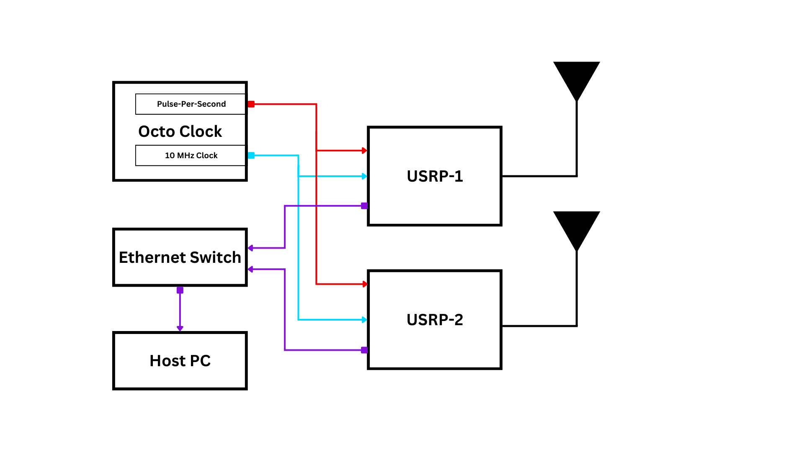
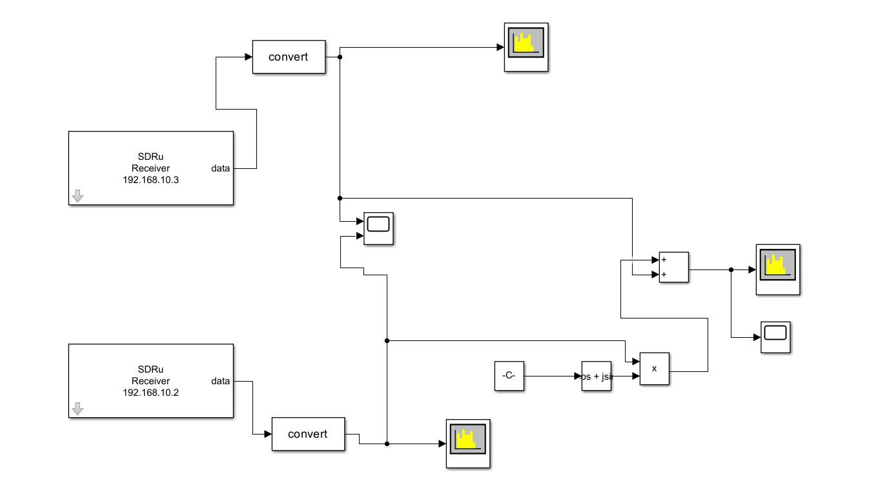
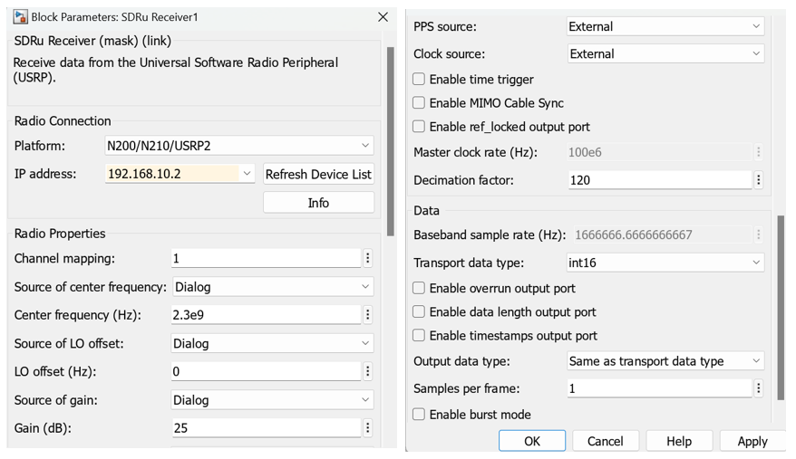
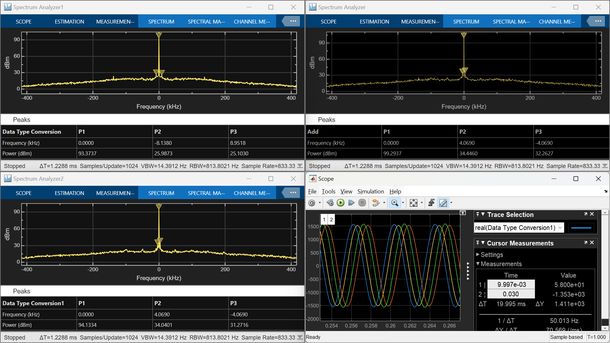
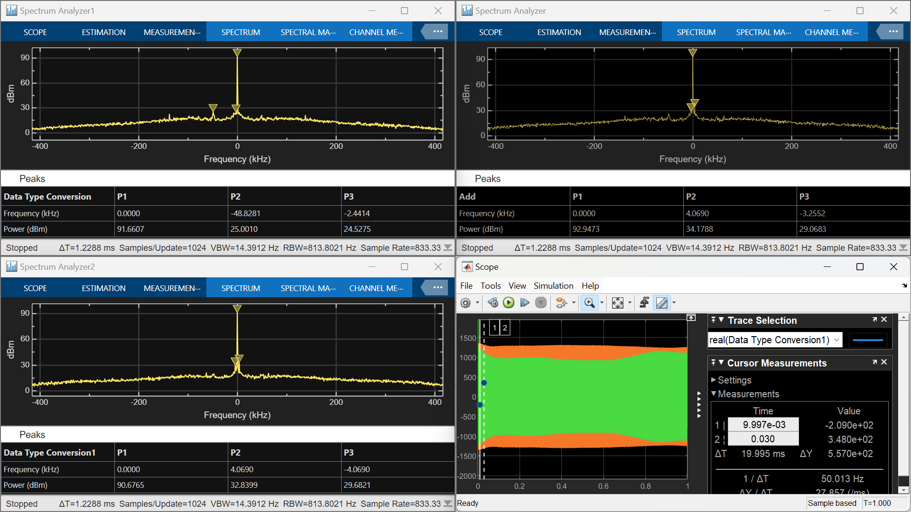
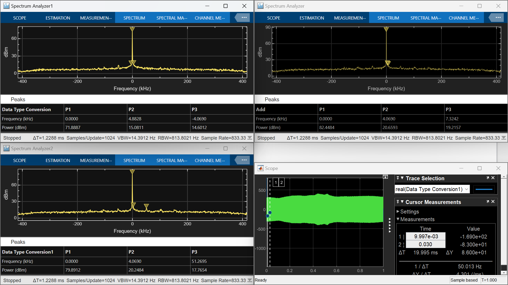

# Solution to MATLAB and Simulink Challenge project <162> <Receiver Digital beamforming  using USRP interfaced with MATLAB>
This is a template repo for MATLAB and Simulink Challenge Project solutions.

[Program link](https://github.com/mathworks/MATLAB-Simulink-Challenge-Project-Hub)

[Project description link](https://github.com/mathworks/MATLAB-Simulink-Challenge-Project-Hub/tree/e86687edb8cdb038e7cf15bc09f95bea313c82c1/projects/Build%20a%20wireless%20communications%20link%20with%20software%20defined%20radio)

# Receiver Digital beamforming  using USRP interfaced with MATLAB
This project was chosen to delve into the practical implementation of MIMO technology, a fundamental aspect of modern wireless communication. By using USRPs and Simulink, it provided hands-on experience with state-of-the-art tools and hardware synchronization techniques. The focus on signal reception with varying transmitter positions allowed us to analyze spatial characteristics and optimize receiver performance. This work bridges the gap between theoretical understanding and real-world applications of advanced communication systems. Additionally, it aligns with emerging research trends in improving network reliability and efficiency in diverse scenarios.

# Project details
A description of the implementation and the approached adopted.

# How to run section
**Required Toolboxes:**
1) communication toolbox
2) DSP toolbox
3) Signal Processing Toolbox
4) Communications Toolbox Support Package for USRP Radio

**Initial Setup**
1) Connect the USRP's in MIMO configuration  as shown in Block Diagram.
2) Configure the USRP's in Matlab
    Matlab --> Add-Ons --> Manage Add-Ons --> Communications Toolbox Support Package for USRP Radio click setup (click the settings it will show Setup) --> select Select Ethernet based radio ( we are using N210 USRP) --> select the check box to manually configure the computer network interface --> if status is avaliable click next --> Test the radio connection ( connected USRP IP Addresses will be shown) then finish the setup.

**Simulink Model**

**Blocks used:**
1) SDRu Receiver  <-- Communications Toolbox Support Package for USRP Radio
2) Data type Conversion ( 16 bit data is recived from receiverblock we need to convert the data type to process in simulink )
3) Constant block ( to give the phase of π*sin(θ *180/π) to one of the received signal)
4) Trigonometric block ( use cos + jsin ) 
5) Product block ( to introduce the phase shift to received signal)
6) Add block ( To add the received signals one is phase shifted signal)
7) Scope ( to check the received signal and Added signal after phase delay)
8) Spectrum Analyser ( to check the power of the signal)

**SDRu Receiver block parameters**

- Platform: N200/N210/USRP2 ( we are using N21o USRP)
- IP Address: Select the IP address of the USRP
- Channel mapping: We are using USRP for receiving the signal only, so choose 1.
- Center Frequency: Give the transmitting signal frequency. We are transmitting 2.3 GHz signal with amplitude of 15dBm.
- LO offset: Use the deafult value 0.
- Gain: Addjust the gain of the received signal by comparing the both received signal strengths at 0 degree phase shift.
- PPS Source: We are using Octo clock for PPS generation, so select External.
- Clock Source: We are using Octo clock for 10 MHz clock Generation, so select External.
- Decimation factor: Choose the values 4 to 512 which are multiples of 4. This factor crucial for sampling frequency addjust it for based on requirements.
- Transport data type: Use Default int16.
- Output data type: Same as the Transport data type.
- Sample per frame: Depends on host computer running capabalities, for this project we used 1 sample per frame.
- Give the Simulation time and run the simulink model, we gave 1 sec simulation time.
# Demo
Here you can find the detail explanation of this project and simulation --> [Receiver-Digital-beamforming-using-USRP-interfaced-with-MATLAB
](https://drive.google.com/file/d/1MBm7_SqjuEqHJ_ImjQLpN-ywFEBipmkL/view)
# Simulation results
**1) Phase shift θ= 0 degree**
- USRP1 Received power= 93.37 dBm
- USRP2 Received power= 94.13 dBm
- Combined Power= 99.29 dBm

**2) Phase shift θ= 10 degree**
- USRP1 Received power= 91.66 dBm
- USRP2 Received power= 90.67 dBm
- Combined Power= 92.95 dBm

**3) Phase shift θ= 15 degree**
- USRP1 Received power= 78.26 dBm
- USRP2 Received power= 80.88 dBm
- Combined Power= 85.16 dBm

**4) Phase shift θ= 20 degree**
- USRP1 Received power= 71.88 dBm
- USRP2 Received power= 79.89 dBm
- Combined Power= 82.45 dBm

# Conclusion
# Reference
Add reference papers, data, or supporting material that has been used, if any.
